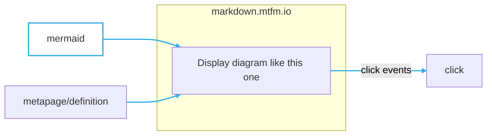
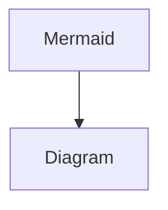

# Markdown viewer [metaframe](https://metapages.org/)

Metaframe (configurable website) for showing markdown.

The _entire_ markdown content can be embedded in the URL.

## Create a standalone markdown page

### 1. Create by pasting or writing markdown in the embedded editor

### 2. Embed markdown via a download link

## Dynamically add content

### Dynamic content via metapages

- input pipes
	- Send any markdown text on any input pipe and this page will display the formatted markdown.
		- Some named pipes are special however: `base64*`: any pipe _ending with_ base64 is assumed base64 encoded and will be decoded

Derived from notion

Displays formatted markdown.

- URL parameter to an external location:
	- [https://markdown.mtfm.io/#?url=https://raw.githubusercontent.com/metapages/metaframe-markdown/main/public/test.md](https://markdown.mtfm.io/#?url=https://raw.githubusercontent.com/metapages/metaframe-markdown/main/public/test.md)

	This downloads the content at [https://github.com/metapages/metaframe-markdown/blob/main/public/test.md](https://github.com/metapages/metaframe-markdown/blob/main/public/test.md) and shows the content as markdown.

- URL parameter with markdown content embedded:

	Add the base64 encoded markdown text string to the URL hash parameter `base64`:

	[https://markdown.mtfm.io/#?base64=](https://markdown.mtfm.io/#?base64=)

	For example:

	[https://markdown.mtfm.io/#?base64=IyBFeGFtcGxlIG1hcmtkb3duIGVtYmVkZGVkIGluIHRoZSBVUkwKClRoaXMgZXhhbXBsZSBtZXRhZnJhbWUgaGFzIG1hcmtkb3duIGVtYmVkZGVkIGluIHRoZSBVUkwgb2YgdGhlIG1hcmtkb3duLWRpc3BsYXkgbWV0YWZyYW1lLiBUaGlzIHRleHQgaXMgZW1iZWRkZWQgaW4gdGhlIFVSTCBhbmQgc2hvd24gaGVyZS4KCiMjIEFuZCBhbm90aGVyIHN1YmhlYWRpbmcKSXQganVzdCBrZWVwcyBnb2luZw==](https://markdown.mtfm.io/#?base64=IyBFeGFtcGxlIG1hcmtkb3duIGVtYmVkZGVkIGluIHRoZSBVUkwKClRoaXMgZXhhbXBsZSBtZXRhZnJhbWUgaGFzIG1hcmtkb3duIGVtYmVkZGVkIGluIHRoZSBVUkwgb2YgdGhlIG1hcmtkb3duLWRpc3BsYXkgbWV0YWZyYW1lLiBUaGlzIHRleHQgaXMgZW1iZWRkZWQgaW4gdGhlIFVSTCBhbmQgc2hvd24gaGVyZS4KCiMjIEFuZCBhbm90aGVyIHN1YmhlYWRpbmcKSXQganVzdCBrZWVwcyBnb2luZw==)

	This gives you a simple way to create static notes or help pages.

