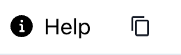
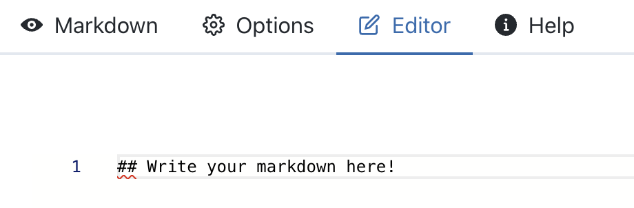
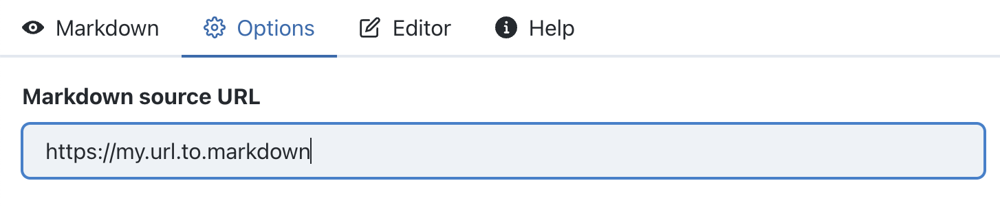
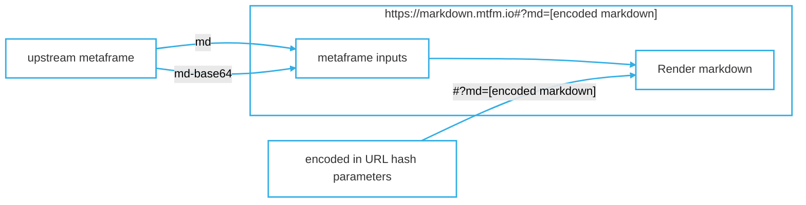

# Markdown viewer [metaframe](https://docs.metapage.io/)


Metaframe (configurable website) for showing markdown.


The URL contains the entire markdown text:


> 🔗 https://markdown.mtfm.io#?md=**<encoded markdown>**


This makes the URL

- **editable**
- **sharable**
- **embeddable**
- **standalone**

[Example standalone app with an editor and the markdown renderer](https://app.metapages.org/#?definition=JTdCJTIybWV0YSUyMiUzQSU3QiUyMmxheW91dHMlMjIlM0ElN0IlMjJyZWFjdC1ncmlkLWxheW91dCUyMiUzQSU3QiUyMmRvY3MlMjIlM0ElMjJodHRwcyUzQSUyRiUyRnd3dy5ucG1qcy5jb20lMkZwYWNrYWdlJTJGcmVhY3QtZ3JpZC1sYXlvdXQlMjIlMkMlMjJsYXlvdXQlMjIlM0ElNUIlN0IlMjJoJTIyJTNBNSUyQyUyMmklMjIlM0ElMjJlZGl0b3IlMjIlMkMlMjJtb3ZlZCUyMiUzQWZhbHNlJTJDJTIyc3RhdGljJTIyJTNBZmFsc2UlMkMlMjJ3JTIyJTNBNiUyQyUyMnglMjIlM0EwJTJDJTIyeSUyMiUzQTAlN0QlMkMlN0IlMjJoJTIyJTNBNSUyQyUyMmklMjIlM0ElMjJtYXJrZG93biUyMiUyQyUyMm1vdmVkJTIyJTNBZmFsc2UlMkMlMjJzdGF0aWMlMjIlM0FmYWxzZSUyQyUyMnclMjIlM0E2JTJDJTIyeCUyMiUzQTYlMkMlMjJ5JTIyJTNBMCU3RCU1RCUyQyUyMnByb3BzJTIyJTNBJTdCJTIyY29scyUyMiUzQTEyJTJDJTIyY29udGFpbmVyUGFkZGluZyUyMiUzQSU1QjUlMkM1JTVEJTJDJTIybWFyZ2luJTIyJTNBJTVCMTAlMkMyMCU1RCUyQyUyMnJvd0hlaWdodCUyMiUzQTEwMCU3RCU3RCU3RCU3RCUyQyUyMm1ldGFmcmFtZXMlMjIlM0ElN0IlMjJlZGl0b3IlMjIlM0ElN0IlMjJ1cmwlMjIlM0ElMjJodHRwcyUzQSUyRiUyRmVkaXRvci5tdGZtLmlvJTJGJTIzJTNGYnV0dG9uJTNEaW52aXNpYmxlJTI2bWVudWhpZGRlbiUzRHRydWUlMjZvcHRpb25zJTNESlRkQ0pUSXlZWFYwYjNObGJtUWxNaklsTTBGMGNuVmxKVEpESlRJeWFHbGtaVzFsYm5WcFptbG1jbUZ0WlNVeU1pVXpRWFJ5ZFdVbE1rTWxNakp0YjJSbEpUSXlKVE5CSlRJeWJXRnlhMlJ2ZDI0bE1qSWxNa01sTWpKellYWmxiRzloWkdsdWFHRnphQ1V5TWlVelFXWmhiSE5sSlRKREpUSXlkR2hsYldVbE1qSWxNMEVsTWpKc2FXZG9kQ1V5TWlVM1JBJTNEJTNEJTI2dGFiJTNEMSUyNnRleHQlM0RKVEl6SlRJd1RXRnlhMlJ2ZDI0bE1qQm9aV0ZrWlhJbE1FRWxNRUZVYUdsekpUSXdhWE1sTWpCdFlYSnJaRzkzYmlVeU1HTnZiblJsYm5RbE1FRWxNRUZCYm1RbE1qQnpiMjFsZEdocGJtY2xNakJsYkhObEpUSXdjMjl0WlElM0QlM0QlMjIlN0QlMkMlMjJtYXJrZG93biUyMiUzQSU3QiUyMmlucHV0cyUyMiUzQSU1QiU3QiUyMm1ldGFmcmFtZSUyMiUzQSUyMmVkaXRvciUyMiUyQyUyMnNvdXJjZSUyMiUzQSUyMnRleHQlMjIlMkMlMjJ0YXJnZXQlMjIlM0ElMjJtZCUyMiU3RCU1RCUyQyUyMnVybCUyMiUzQSUyMmh0dHBzJTNBJTJGJTJGbWFya2Rvd24ubXRmbS5pbyUyRiUyMyUzRmJ1dHRvbiUzRGludmlzaWJsZSUyNm1kJTNESlRJekpUSXdWR2hwY3lVeU1HbHpKVEl3ZVc5MWNpVXlNRzFoY210a2IzZHVKVEJCSlRCQlZHaGxKVEl3VlZKTUpUSXdZMjl1ZEdGcGJuTWxNakJoYkd3bE1qQjBhR1VsTWpCamIyNTBaVzUwJTI2bWVudWhpZGRlbiUzRHRydWUlMjZvcHRpb25zJTNESlRkQ0pUSXlaR2x6Y0d4aGVXMXZaR1VsTWpJbE0wRWxNakprWldaaGRXeDBKVEl5SlRkRSUyMiU3RCU3RCUyQyUyMnBsdWdpbnMlMjIlM0ElNUIlMjJodHRwcyUzQSUyRiUyRm1ldGFwYWdlcy5vcmclMkZtZXRhZnJhbWVzJTJGbWVybWFpZC5qcyUyRiUzRlRJVExFJTNEMCUyMiUyQyUyMmh0dHBzJTNBJTJGJTJGZWRpdG9yLm10Zm0uaW8lMkYlMjMlM0ZvcHRpb25zJTNEZXlKdGIyUmxJam9pYW5OdmJpSXNJbk5oZG1Wc2IyRmthVzVvWVhOb0lqcG1ZV3h6WlN3aWRHaGxiV1VpT2lKMmN5MWtZWEpySW4wJTNEJTIyJTVEJTJDJTIydmVyc2lvbiUyMiUzQSUyMjAuMyUyMiU3RA==)


## **How to create / edit**


<div style="display: flex; justify-content: space-evenly; flex-direction: row; flex-wrap: nowrap; "><div><p>To modify the options, edit them in the webpage, then copy the URL with the copy button </p>
</div><div><p></p>
</div><div>
<br/></div></div>


**Option 1: Pasting or write markdown in the embedded editor**


<div style="display: flex; justify-content: space-evenly; flex-direction: row; flex-wrap: nowrap; "><div>
<br/></div><div><p></p>
</div><div>
<br/></div></div>


**Option 2: Embedding markdown via a download link**


<div style="display: flex; justify-content: space-evenly; flex-direction: row; flex-wrap: nowrap; "><div><p>The link points to a URL where the markdown text will be downloaded.</p>
</div><div><p></p>
</div><div>
<br/></div><div>
<br/></div></div>


## Dynamically add content


### Dynamic content via metapages




- input pipes:
	- `md`
		- Raw markdown text
	- `md-base64`
		- base64 encoded markdown text

Any text coming in those input pipes will be immediately rendered. If there is markdown embedded in the URL, that will be rendered first, but replaced by any markdown from input pipes.


## Embed markdown renderer in another application


It requires no installation, and is secure due to cross-origin isolation.


### E.g. React


The help menu on this website uses this page in a external iframed element. While this uses `@metapages/metapage-embed-react` to make some things more convenient, you can also just embed a `<iframe src="<url>" />` element directly:


```typescript
import { useCallback } from 'react';

import { MetaframeStandaloneComponent } from '@metapages/metapage-embed-react';

export const PanelMarkdownEditor: React.FC<{markdown:string}> = ({markdown) => {
  
  return (
    <div>
      <MetaframeStandaloneComponent
        url="https://markdown.mtfm.io/#?button=invisible&md=JTIzJTIwVGhpcyUyMGlzJTIweW91ciUyMG1hcmtkb3duJTBBJTBBVGhlJTIwVVJMJTIwY29udGFpbnMlMjBhbGwlMjB0aGUlMjBjb250ZW50&menuhidden=true&options=JTdCJTIyZGlzcGxheW1vZGUlMjIlM0ElMjJkZWZhdWx0JTIyJTdE"
        inputs={{ value: markdown}}
      />
    </div>
  );
};
```


## Developers: creating your own markdown links 


You can generate your own markdown pages to display in your own webpages easily as embedded iframes.


The markdown text is simply encoded as follows:


```typescript
export const encodeMarkdown = (md: string) => {
  var b64 = window.btoa(encodeURIComponent(md));
  return b64;
};

const yourRawMarkdown = "### Title\n\nSome content";
const encodedMarkdown = encodeMarkdown(yourRawMarkdown);
const url = `https://markdown.mtfm.io/#?button=invisible&md=${encodedMarkdown}&menuhidden=true&options=JTdCJTIyZGlzcGxheW1vZGUlMjIlM0ElMjJkZWZhdWx0JTIyJTdE`
```


Just take that `url` and embed as described above, or via embedded as an iframe:


`<iframe src={url} />`

